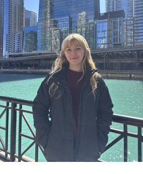

```{=html}
<!-- Profile picture: change object-position in styles.css to adjust the crop -->
<div>
<p>

</p>
</div>
```

Welcome to my website!

My name is Haley McCann, and I am learning how to code! :)

This is my first website ever so please be nice lol

------------------------------------------------------------------------

## About Me

I am a fourth year biology major and I am very interested in traveling the world and exploring nature. I work as a tutor at Ramona High School, and I am also a Peer Mentor at the Academic Resource Center! I also participate in two research labs at UC Riverside as listed below.

------------------------------------------------------------------------

## Research Experience

```{=html}
<div class="project">
  <h3>Spasojevic Lab</h3>
  <p>This is a link to a research lab I am apart of!</p>
  <a href="https://mspaso.wixsite.com/traitecology" target="_blank">visit the lab website →</a>
</div>

<div class="project">
  <h3>Rankin Lab</h3>
  <p>This is research I was apart of last summer.</p>
  <a href="https://faculty.ucr.edu/~eewilson/" target="_blank">visit the lab website →</a>
</div>
```

------------------------------------------------------------------------

## Skills

-   HTML
-   CSS
-   R Script Coding

------------------------------------------------------------------------

## Contact Me

Email me at: [hmcca006\@ucr.edu](mailto:hmcca006@ucr.edu)

My github is: [github.com/Hmcca006](https://github.com/Hmcca006)

<p class="footer-text">

-- made by Haley McCann 2026 --

</p>
